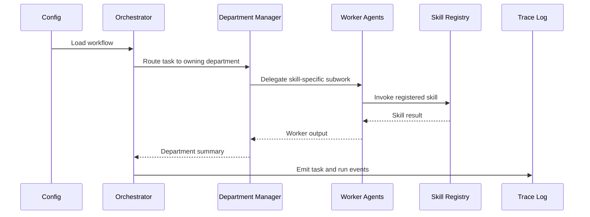

# Architecture

`nano-agent-stack` provides a compact execution model for auditable multi-agent systems.

## Concepts

- **Orchestrator**: central runtime that loads config, enforces policy, and coordinates task execution.
- **Departments**: organizational units that own tasks and route work.
- **Agents**: managers and workers with explicit role definitions.
- **Skills**: reusable capabilities registered by ID.
- **Policies**: execution limits and approval requirements.
- **Memory interfaces**: decoupled adapters for run state.
- **Trace hooks**: run events emitted during execution.
- **Human checkpoints**: review gates that can be turned on when needed.

## Flow

## Boundaries

- Model provider abstraction is intentionally deferred to a follow-up milestone.
- Persistent memory adapters are not implemented in v0.1.
- Human checkpoints are traced but not yet wired to an interactive approval service.

