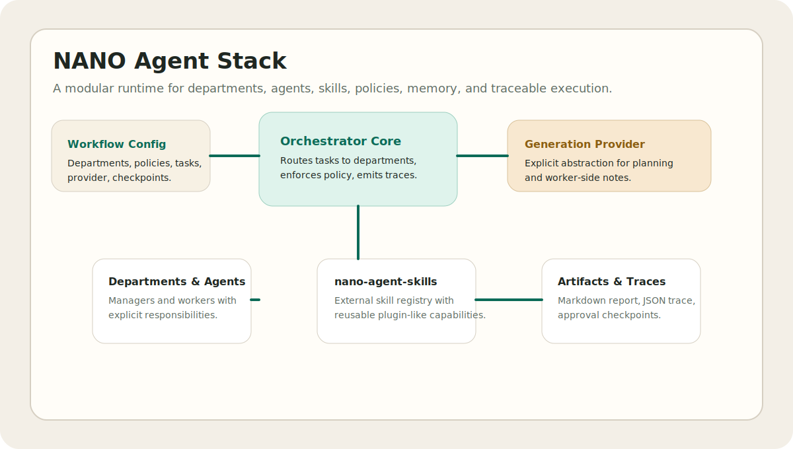
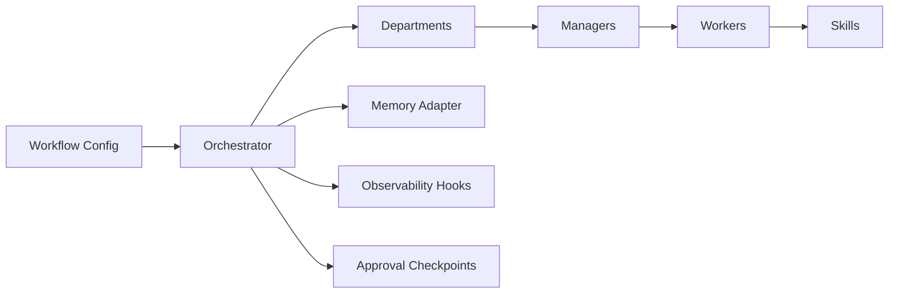

# NANO Agent Stack

[](https://github.com/r4ullopezdev/nano-agent-stack/actions/workflows/ci.yml)
[](./LICENSE)
[](./ROADMAP.md)

Experimental open-source infrastructure for modular, auditable multi-agent orchestration.

`nano-agent-stack` is not another chatbot wrapper. It is a small but real runtime for representing organizations as agent systems: departments, managers, worker agents, registrable skills, execution policy, memory interfaces, trace hooks, and optional human checkpoints.



## Why this exists

Most agent demos collapse orchestration into hidden prompts and brittle glue code. That makes them hard to reason about, hard to audit, and hard to adapt to real organizational workflows.

This project takes a different position:

- agent systems should expose structure, not hide it
- departments and hierarchies should be modeled explicitly
- skills should be portable and replaceable
- runs should be traceable and reviewable
- human approval should be a first-class option, not an afterthought

## What is in v0.1

- central orchestrator with execution policy enforcement
- department-based task routing
- agent role definitions with declarative skills
- real dependency on `nano-agent-skills` for the skill registry
- validated workflow configuration loading
- in-memory and file-backed memory adapters
- real human approval checkpoints that can gate task execution
- explicit provider abstraction for generation backends
- experimental end-to-end providers for OpenAI Responses and Anthropic Messages
- trace collection for every run
- CLI-level template discovery and workflow validation
- CLI demo for CEO -> department manager -> workers

## Architecture



More detail lives in [ARCHITECTURE.md](./ARCHITECTURE.md) and [docs/architecture.md](./docs/architecture.md).

## Quickstart

```bash
npm install
npm run demo
npm run demo:content
npm run demo:support
npm run demo:openai
npm run demo:anthropic
npm run validate:demo
npm run templates
```

Expected result:

- a terminal report of the workflow run
- generated artifacts at `artifacts/latest-run.md`, `artifacts/latest-run.json`, `artifacts/latest-trace.md`, and `artifacts/latest-run-inspector.html`
- a trace showing task routing, skill calls, and approval decisions
- optional file-backed workflow memory when configured

For a fuller setup path, see [QUICKSTART.md](./QUICKSTART.md).

## Demo workflow

The included example models a lightweight organizational chain:

1. a CEO-level intent defines delivery expectations
2. a department manager accepts the task
3. worker agents invoke different skills
4. the orchestrator emits run traces and writes a task summary to memory

Run it explicitly:

```bash
npm run dev -- run examples/ceo-launch.yaml
```

Additional examples:

- `examples/content-ops.yaml`
- `examples/support-triage.yaml`
- `examples/experimental-openai.yaml`
- `examples/experimental-anthropic.yaml`

## Provider abstraction

The runtime now includes a real provider boundary:

- `static-scenario`: deterministic provider for structural demos and tests
- `echo`: deterministic provider that echoes objective and role context

This keeps the orchestration layer independent from any single model vendor while making the boundary explicit in code today, not as roadmap vapor.

Experimental remote providers are also available:

- `openai-responses`
- `anthropic-messages`

These are marked experimental because they require API keys, have not been validated in CI, and are intended as integration seams rather than production-ready provider clients.

## Environment

Copy `.env.example` or export the variables directly before using experimental providers:

```bash
OPENAI_API_KEY=...
ANTHROPIC_API_KEY=...
```

## Memory adapters

The runtime now supports:

- `in-memory`: default ephemeral state for demos and tests
- `file`: simple persisted state for local runs and repeatable examples

The `content-ops` example demonstrates file-backed memory.

## Human approval checkpoints

Approval checkpoints now gate execution instead of only emitting traces.

- interactive runs prompt a reviewer in the terminal
- CI and demos can use `--auto-approve` or `--auto-reject`
- approval decisions are written into the run trace and included in the markdown report

For scripted review control:

```bash
tsx src/cli.ts run examples/ceo-launch.yaml --auto-reject --reviewer qa-lead --approval-reason "Needs revision"
```

## Experimental providers

The remote providers remain explicitly experimental, but the integration is now exercised end-to-end at the package level:

- `openai-responses`
- `anthropic-messages`

Both providers now use a shared HTTP provider layer, typed response parsing, example configs, and integration-style tests with injected fetchers.

## Template bridge

`nano-agent-stack` now understands the `nano-agent-templates` package at the CLI level:

```bash
npm run templates
```

This keeps templates discoverable from the core runtime without hard-wiring the template content into the orchestrator itself.

## Repository layout

```text
docs/                 Architecture notes and diagrams
examples/             Executable workflow examples
src/                  Runtime, CLI, skills, memory, tracing
tests/                Basic runtime tests
.github/workflows/    Lint and test automation
```

## Why it is different

- It treats multi-agent systems as organizational infrastructure.
- It keeps the runtime intentionally small and inspectable.
- It separates policies, memory, skills, and routing instead of fusing them into a single agent abstraction.
- It is designed to sit underneath different model providers and specialized skill packages.

## Comparison

For a neutral positioning note against related frameworks, see [docs/framework-comparison.md](./docs/framework-comparison.md).

## Ecosystem

- `nano-agent-stack`: core orchestrator runtime
- `nano-agent-skills`: reusable skills and plugin contracts
- `nano-agent-templates`: workflow templates and prompt contracts
- `nano-agent-observability`: tracing, logging, and run exports
- `nano-agent-docs`: deeper adoption and design documentation
- `nano-agent-bench`: small, honest workflow-structure benchmarks

## Status

This repository is alpha by design. It is suitable for experimentation, demos, and extension work. It is not positioned as production-ready infrastructure yet.

## License

Apache-2.0. The ecosystem is intended to be permissive for builders while preserving explicit patent grants and clear reuse terms for infrastructure code.

## Roadmap

See [ROADMAP.md](./ROADMAP.md) for the staged path from core runtime to broader public beta.
