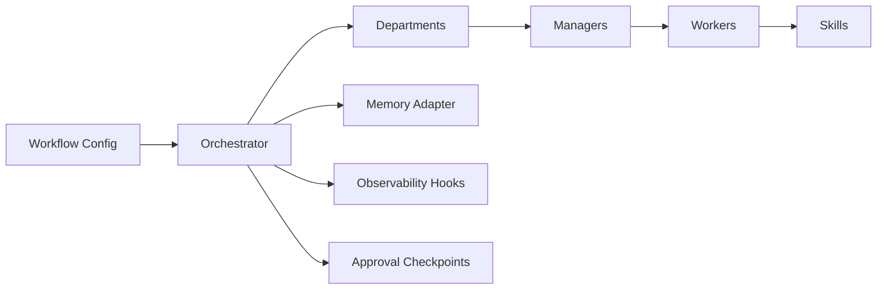

# NANO Agent Stack

[](https://github.com/r4ullopezdev/nano-agent-stack/actions/workflows/ci.yml)
[](./LICENSE)
[](./ROADMAP.md)

Experimental open-source infrastructure for modular, auditable multi-agent orchestration.

`nano-agent-stack` is not another chatbot wrapper. It is a small but real runtime for representing organizations as agent systems: departments, managers, worker agents, registrable skills, execution policy, memory interfaces, trace hooks, and optional human checkpoints.

## Why this exists

Most agent demos collapse orchestration into hidden prompts and brittle glue code. That makes them hard to reason about, hard to audit, and hard to adapt to real organizational workflows.

This project takes a different position:

- agent systems should expose structure, not hide it
- departments and hierarchies should be modeled explicitly
- skills should be portable and replaceable
- runs should be traceable and reviewable
- human approval should be a first-class option, not an afterthought

## What is in v0.1

- central orchestrator with execution policy enforcement
- department-based task routing
- agent role definitions with declarative skills
- pluggable skill registry
- in-memory state adapter interface
- trace collection for every run
- optional human approval checkpoints
- CLI demo for CEO -> department manager -> workers

## Architecture



More detail lives in [ARCHITECTURE.md](./ARCHITECTURE.md) and [docs/architecture.md](./docs/architecture.md).

## Quickstart

```bash
npm install
npm run demo
```

Expected result:

- a terminal report of the workflow run
- a generated artifact at `artifacts/latest-run.md`
- a trace showing task routing, skill calls, and approval checkpoints

For a fuller setup path, see [QUICKSTART.md](./QUICKSTART.md).

## Demo workflow

The included example models a lightweight organizational chain:

1. a CEO-level intent defines delivery expectations
2. a department manager accepts the task
3. worker agents invoke different skills
4. the orchestrator emits run traces and writes a task summary to memory

Run it explicitly:

```bash
npm run dev -- run examples/ceo-launch.yaml
```

## Repository layout

```text
docs/                 Architecture notes and diagrams
examples/             Executable workflow examples
src/                  Runtime, CLI, skills, memory, tracing
tests/                Basic runtime tests
.github/workflows/    Lint and test automation
```

## Why it is different

- It treats multi-agent systems as organizational infrastructure.
- It keeps the runtime intentionally small and inspectable.
- It separates policies, memory, skills, and routing instead of fusing them into a single agent abstraction.
- It is designed to sit underneath different model providers and specialized skill packages.

## Ecosystem

- `nano-agent-stack`: core orchestrator runtime
- `nano-agent-skills`: reusable skills and plugin contracts
- `nano-agent-templates`: workflow templates and prompt contracts
- `nano-agent-observability`: tracing, logging, and run exports
- `nano-agent-docs`: deeper adoption and design documentation

## Status

This repository is alpha by design. It is suitable for experimentation, demos, and extension work. It is not positioned as production-ready infrastructure yet.

## License

Apache-2.0. The ecosystem is intended to be permissive for builders while preserving explicit patent grants and clear reuse terms for infrastructure code.

## Roadmap

See [ROADMAP.md](./ROADMAP.md) for the staged path from core runtime to broader public beta.

