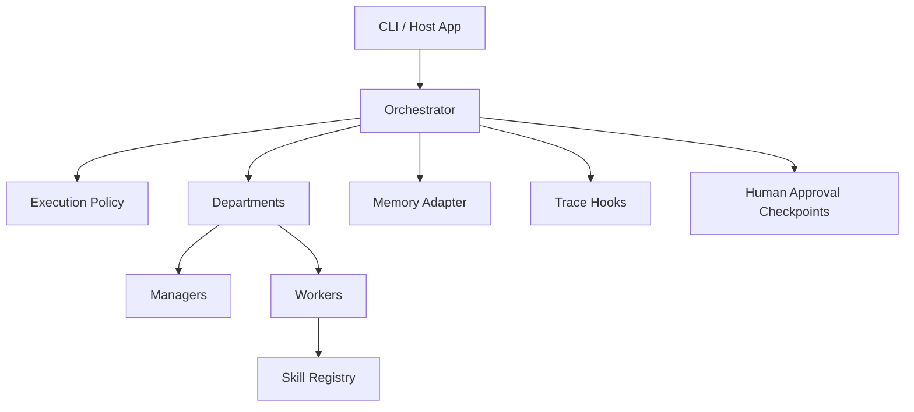

# Architecture

`nano-agent-stack` models agent systems as explicit organizational structures instead of opaque prompt chains.

## Core layers

## Execution model

1. The orchestrator loads a workflow config.
2. Each task is routed to a department.
3. The department manager selects workers and skills.
4. Skill invocations emit trace events.
5. Final task summaries are written through the memory adapter.
6. Optional checkpoints preserve a place for human approval.

